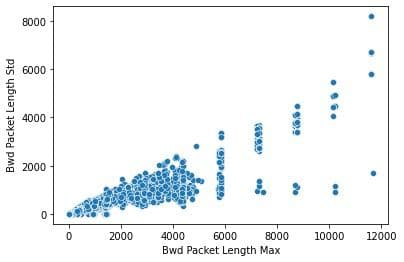
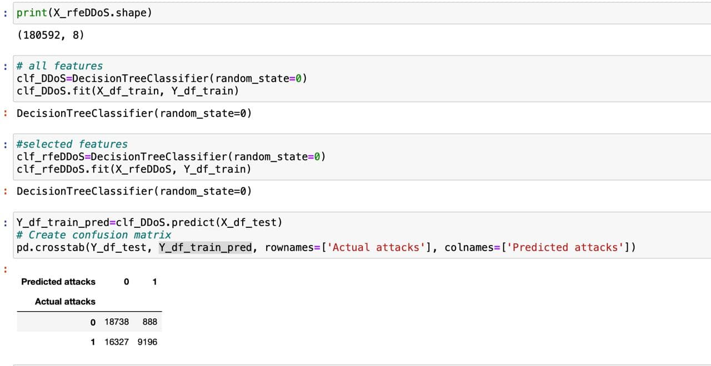

## **Detection of DDOS attacks by comparing classical machine learning method, reinforcement learning and deep learning methods**

### Neural Networks and Algorithms 🤹‍♀️
* [📺 Reinforcement Learning](https://www.youtube.com/watch?v=LzaWrmKL1Z4)
* [📺 Desicion Trees](https://www.youtube.com/watch?v=jVh5NA9ERDA)
* [📺 Recurrent Neural Network](https://www.youtube.com/watch?v=y7qrilE-Zlc)
* [📺 LSTM](https://www.youtube.com/watch?v=BSpXCRTOLJA)
* [📺 Bidirectional LSTM](https://www.youtube.com/watch?v=bTXGpATdKRY)

**Desicion Tree Classifier:**

## *Results of Networks and Algorithms* 🔮

| Framework | Information | 
| :--- | :--- |
| Bidirectional LSTM | 99.7 % 
| SVM | 97.12 %|
| Desicion Trees |99.95 % 

